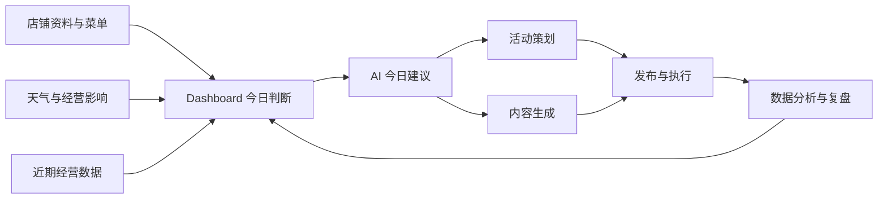
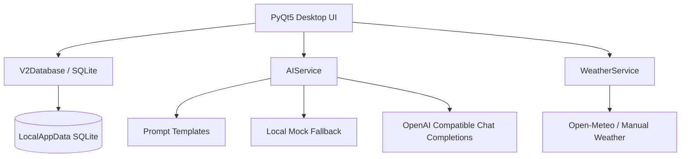

# 校园商家 AI 增长助理

<p align="center">
  <strong>面向校园周边小微商家的本地 AI 运营工作台</strong>
</p>

<p align="center">
  
  
  
  
  
</p>

<p align="center">
  中文 · <a href="./README_EN.md">English</a>
</p>

---

校园商家 AI 增长助理是一款使用 PyQt5 + SQLite 构建的 Windows 本地桌面应用，面向学校周边的小吃店、奶茶店、快餐店等小微商家老板或店长。

它把天气变化、菜单套餐、活动策划、营销文案、评论回复和收支复盘放在同一个轻量工作台中，帮助商家快速判断今天卖什么、怎么发、效果怎么样。

当前项目是一个完整可运行的 MVP Demo，默认内置“东门小吃铺”示例数据，可用于课程作业、创业项目验证、产品 Demo 或技术面试展示。

## ✨ 产品亮点

- 🧭 Dashboard：聚合天气、经营指标、今日任务和 AI 今日建议。
- 🌦 动态天气经营影响：根据日期、天气、温度、降水概率和风速生成经营提示。
- ✍️ AI 内容生成：支持微信群、朋友圈、小红书、抖音、海报、评论回复、私域复购等场景。
- 🧾 活动策划：支持立减、满减、折扣、固定套餐价、赠品、限时券等优惠规则。
- 📊 数据分析：支持收入、成本、到店人数、核销数、套餐表现和活动效果复盘。
- 🔐 本地数据优先：SQLite 存储在用户本机，API Key 加密保存。
- 🧪 可测试：包含自动化测试，覆盖核心业务逻辑和数据迁移。

## 🖼 产品工作流



## 🧱 技术架构



## 🚀 快速开始

安装依赖：

```powershell
python -m pip install -r requirements.txt
```

启动应用：

```powershell
.\run.bat
```

如果启动脚本中的 Python 解释器配置与本机环境不一致，也可以在激活环境后直接运行：

```powershell
python app.py
```

启动链路：

```text
run.bat -> app.py -> app_v2.py
```

说明：`app_v2.py` 是当前主程序；`app.py` 保留为兼容入口。

## 🔑 默认账号

```text
账号：admin
密码：admin
```

首次启动时，`admin` 账号会初始化为“东门小吃铺”Demo 数据。

## 🍢 内置 Demo 数据

| 类型 | 内容 |
| --- | --- |
| 店铺 | 东门小吃铺 |
| 地址 | 北京市海淀区学院路 |
| 主营 | 炸鸡、烤肠、饭团、关东煮、饮品 |
| 单品 | 香酥炸鸡排、烤肠、饭团、关东煮三件套、柠檬茶、热豆浆 |
| 套餐 | 鸡排柠檬茶套餐、饭团关东煮豆浆套餐、烤肠饭团套餐、关东煮豆浆套餐 |
| 数据 | 近 7 天收支、套餐表现、活动记录、今日任务 |

如需恢复演示数据，可在应用内进入：

```text
设置 -> 店铺信息 -> 重置为东门小吃铺 Demo 数据
```

## 🤖 AI API 配置

应用支持 OpenAI Chat Completions 兼容接口。进入：

```text
设置 -> AI API 配置
```

DeepSeek 默认配置：

| 字段 | 值 |
| --- | --- |
| Provider | DeepSeek |
| Base URL | https://api.deepseek.com |
| Model Name | deepseek-chat |

说明：

- 未配置 API Key 时，系统自动使用本地 Mock AI，保证 Demo 可运行。
- 配置 API Key 后，可点击“测试连接”验证接口。
- API Key 使用本机加密存储，不在界面明文回显。
- Prompt 和输出清洗已限制 Markdown / LaTeX 格式，生成结果以可复制纯文本为主。

## 🌦 天气能力

Dashboard 支持实时天气刷新和手动天气录入。

天气经营影响会根据以下字段动态变化：

- 日期
- 城市
- 天气文本
- 当前温度
- 今日最高/最低温
- 降水概率
- 风速

| 天气 | 经营建议 |
| --- | --- |
| 雨天 | 主推热食、热饮、外带包装，减少排队等待 |
| 高温 | 主推冷饮、柠檬茶和清爽小吃 |
| 降温 | 主推关东煮、热豆浆和热食套餐 |
| 大风 | 提前在微信群/朋友圈触达，主推快速打包套餐 |

## 📊 数据分析能力

支持录入并分析：

- 总收入
- 食材成本
- 人工成本
- 平台推广成本
- 优惠成本
- 其他成本
- 到店人数
- 优惠券核销数
- 套餐表现
- 活动效果

自动计算：

- 总成本
- 毛利润
- 毛利率
- 客单价
- 单客成本
- 核销率

折线图支持鼠标悬停查看每个数据点的日期、指标和数值。

## 📁 项目结构

```text
.
├── app.py                         # 兼容入口，转发到 app_v2.main()
├── app_v2.py                      # 当前主界面与页面逻辑
├── run.bat                        # Windows 启动脚本
├── requirements.txt               # Python 依赖
├── README.md                      # 中文说明
├── README_EN.md                   # English documentation
├── campus_growth/
│   ├── core.py                    # 用户、设置、基础数据库和本机加密
│   ├── v2_store.py                # V2 数据模型、迁移、Demo 数据和业务读写
│   ├── ai_service.py              # 统一 AI 调用、Mock 回退和输出清洗
│   ├── prompt_templates.py        # Prompt 模板
│   └── services/
│       ├── weather.py             # 天气接口、天气标签和经营影响
│       ├── ai_request.py          # OpenAI 兼容请求
│       ├── calendar_service.py    # 校历文件解析能力
│       └── calendar_analysis.py   # 校历规则/AI 分析
└── tests/                         # 自动化测试
```

## 🧪 测试

运行全部测试：

```powershell
python -m pytest tests -q
```

建议提交改动前执行：

```powershell
python -m py_compile app_v2.py campus_growth\v2_store.py campus_growth\ai_service.py campus_growth\prompt_templates.py campus_growth\services\weather.py
python -m pytest tests -q
```

## 🔐 数据与隐私

- 默认数据保存在当前 Windows 用户的 LocalAppData 目录：

```text
%LOCALAPPDATA%\CampusGrowthAssistant
```

- 本项目不提供云同步。
- 店铺数据、财务数据和生成历史默认只保存在本机。
- 只有刷新天气或配置 AI API 后，才会发起对应网络请求。
- API Key 使用本机加密方式保存，界面不会明文回显。

## 🧩 开发规范

- 业务逻辑优先放入 `campus_growth/` 模块，避免全部堆在 UI 层。
- AI 调用统一通过 `AIService`，不要在页面里直接拼 API 请求。
- Prompt 统一维护在 `prompt_templates.py`。
- 数据结构变更通过 `v2_store.py` 做幂等迁移。
- 修改后至少运行编译检查和测试。

## 🛣 Roadmap

- 接入更完整的天气服务配置。
- 增强校历导入后的运营节点识别。
- 增加活动 ROI、套餐毛利和时段转化分析。
- 支持导出经营日报。
- 支持更多本地模型或私有化模型接口。

## 🤝 Contributing

欢迎基于当前 MVP 继续扩展。建议提交改动时说明：

- 改动目标
- 涉及页面或模块
- 数据库是否有迁移
- 是否影响 Demo 数据
- 已运行的测试命令
