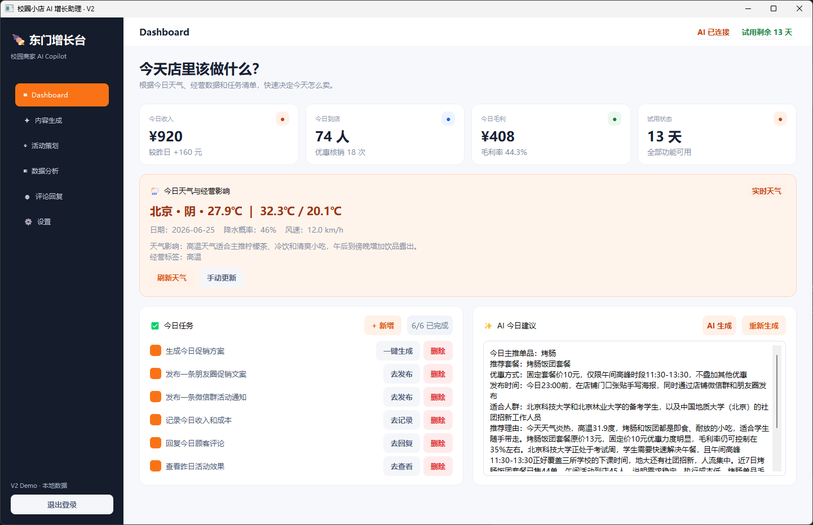
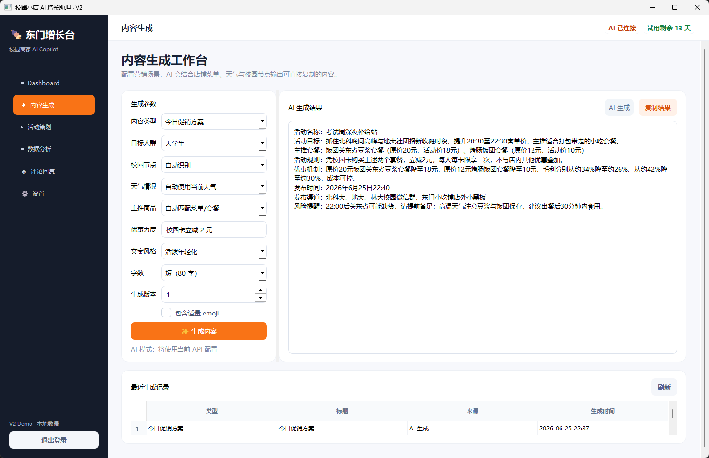
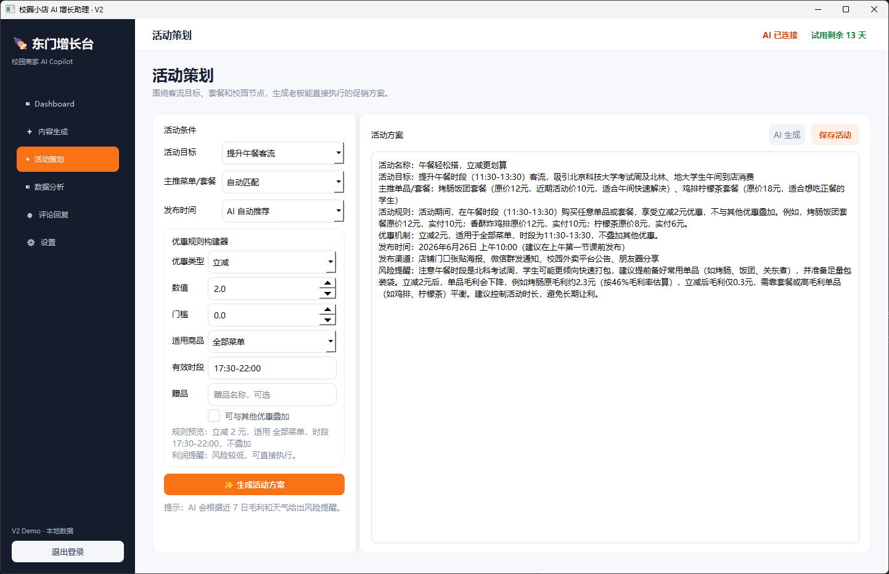
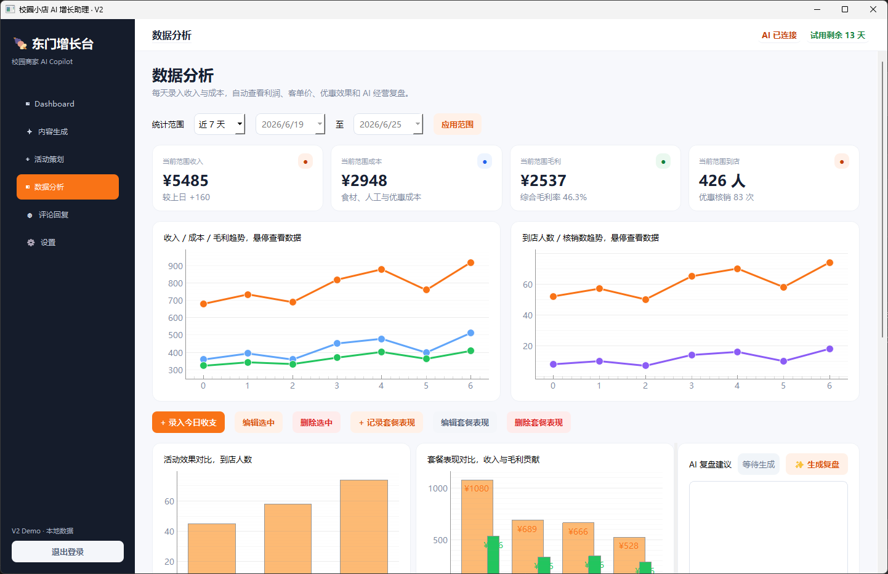
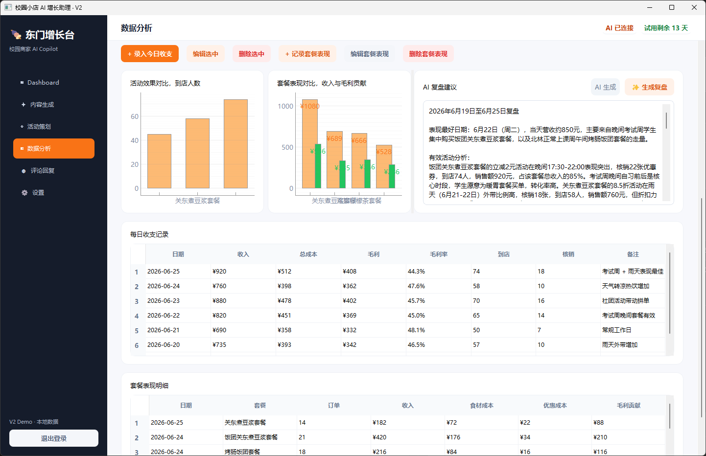
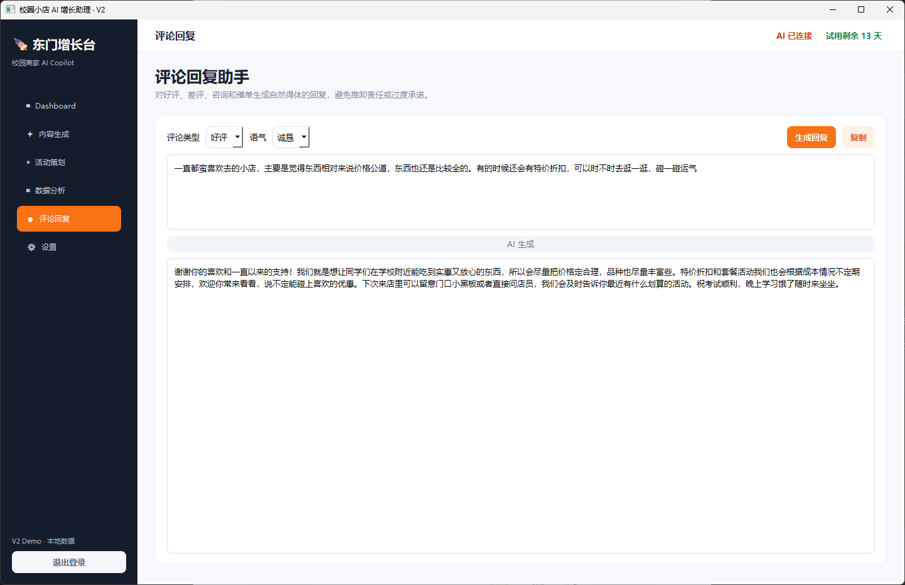
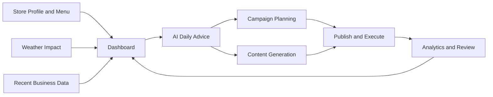
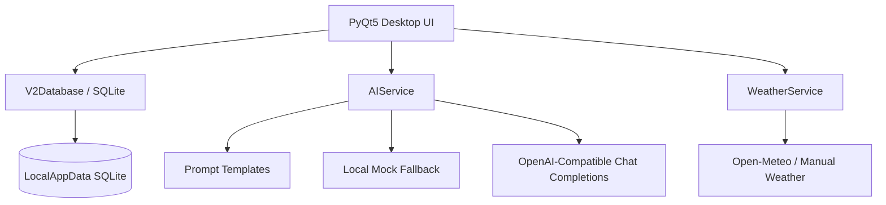

# Campus Merchant AI Growth Assistant

<p align="center">
  <strong>A local AI operations dashboard for small merchants around campuses</strong>
</p>

<p align="center">
  
  
  
  
  
</p>

<p align="center">
  <a href="./README.md">中文</a> · English
</p>

---

Campus Merchant AI Growth Assistant is a local Windows desktop application built with PyQt5 and SQLite. It is designed for small merchants around universities, such as snack shops, milk tea stores, fast-food restaurants, and campus-side convenience businesses.

The product brings weather-aware operation suggestions, menu/package management, campaign planning, AI copywriting, customer review replies, and finance analytics into one lightweight local dashboard.

This repository is a runnable MVP demo. It includes a built-in sample shop called “Dongmen Snack Shop”, making it suitable for product validation, coursework, startup demos, and technical interviews.

## ✨ Highlights

- 🧭 Dashboard for daily metrics, weather impact, tasks, and AI recommendations.
- 🌦 Dynamic weather impact based on date, city, weather, temperature, precipitation, and wind speed.
- ✍️ AI-powered copy generation for WeChat groups, Moments, Xiaohongshu, Douyin, posters, review replies, private traffic, and member recall.
- 🧾 Flexible campaign planning with discount rules.
- 📊 Finance analytics with revenue, costs, profit, visitors, coupon usage, package performance, and campaign comparison.
- 🔐 Local-first data storage with encrypted API key storage.
- 🧪 Automated tests for core business logic and data migration.

## 📸 Screenshots

The screenshots are stored in the `picture/` directory. They show the main pages of the current MVP demo. The image size is 1442 × 932, suitable for desktop demos around 1440px wide.

### Dashboard

The Dashboard is designed for the first daily check-in. It brings together revenue, visitors, gross profit, trial status, weather impact, daily tasks, and AI daily advice.



### Content Generation

The content generation page uses a left-side parameter form, a right-side preview area, and a history table below. Users can choose channel, audience, weather, promoted item/package, offer, and style to generate copy-ready plain text.



### Campaign Planning

The campaign planning page generates executable promotion plans based on traffic goals, promoted packages, publishing windows, and discount rules. The discount builder supports cash-off, threshold discount, percentage discount, fixed package price, gifts, and limited-time coupons.



### Analytics Overview

The analytics page supports 7-day, 14-day, 30-day, and custom date ranges for revenue, costs, gross profit, visitors, and coupon redemptions. Line charts support hover details for date and exact value.



### Package and Campaign Performance

The extended analytics view compares campaign performance, package performance, AI review suggestions, and daily finance records, helping merchants identify which packages and promotions actually convert.



### Review Reply Assistant

The review reply page supports positive reviews, negative reviews, inquiries, and delivery/status complaints. Negative review replies prioritize apology, action plan, and private follow-up guidance.



## 🖼 Product Workflow



## 🧱 Architecture



## 🚀 Quick Start

Recommended Conda environment:

```powershell
conda activate DXapp101
```

Install dependencies:

```powershell
python -m pip install -r requirements.txt
```

Start the app:

```powershell
.\run.bat
```

If the Python interpreter configured in the startup script does not match your local environment, activate the environment and run:

```powershell
python app.py
```

Launch chain:

```text
run.bat -> app.py -> app_v2.py
```

`app_v2.py` is the current main application. `app.py` is kept as a compatibility entry point.

## 🔑 Default Account

```text
Username: admin
Password: admin
```

On first launch, the `admin` account is initialized with built-in demo data.

## 🍢 Built-in Demo Data

| Type | Content |
| --- | --- |
| Shop | Dongmen Snack Shop |
| Address | Xueyuan Road, Haidian District, Beijing |
| Main business | Fried chicken, sausages, rice rolls, oden, drinks |
| Items | Crispy chicken cutlet, sausage, rice roll, oden set, lemon tea, hot soy milk |
| Packages | Chicken Cutlet Lemon Tea Set, Rice Roll Oden Soy Milk Set, Sausage Rice Roll Set, Oden Soy Milk Set |
| Data | Recent 7-day finance records, package metrics, campaign records, daily tasks |

To restore the demo data, open:

```text
Settings -> Store Profile -> Reset Demo Data
```

## 🤖 AI API Configuration

The app supports OpenAI Chat Completions compatible APIs. Open:

```text
Settings -> AI API Configuration
```

Default DeepSeek configuration:

| Field | Value |
| --- | --- |
| Provider | DeepSeek |
| Base URL | https://api.deepseek.com |
| Model Name | deepseek-chat |

Notes:

- Without an API key, the app falls back to local mock AI responses.
- After entering an API key, use “Test Connection” to verify the configuration.
- API keys are encrypted locally and are not displayed in plain text.
- Prompts and output cleanup are designed to avoid Markdown / LaTeX artifacts in generated copy.

## 🌦 Weather

The Dashboard supports real-time weather refresh and manual weather input.

Weather impact is generated dynamically from:

- Date
- City
- Weather text
- Current temperature
- Daily high / low temperature
- Precipitation probability
- Wind speed

| Weather | Business suggestion |
| --- | --- |
| Rainy | Promote hot food, hot drinks, takeaway packaging, and faster queue handling |
| Hot | Promote cold drinks, lemon tea, and refreshing snacks |
| Cooling down | Promote oden, hot soy milk, and hot food packages |
| Windy | Reach customers early via WeChat groups or Moments, and promote quick takeaway packages |

## 📊 Analytics

The analytics module supports:

- Daily revenue
- Ingredient cost
- Labor cost
- Promotion cost
- Discount cost
- Other costs
- Visitor count
- Coupon redemption count
- Package performance
- Campaign comparison

It automatically calculates:

- Total cost
- Gross profit
- Gross margin
- Average order value
- Cost per customer
- Redemption rate

Line charts support hover details for date, metric name, and exact value.

## 📁 Project Structure

```text
.
├── app.py                         # Compatibility entry point, forwards to app_v2.main()
├── app_v2.py                      # Current main UI and page logic
├── run.bat                        # Windows startup script
├── requirements.txt               # Python dependencies
├── README.md                      # Chinese documentation
├── README_EN.md                   # English documentation
├── campus_growth/
│   ├── core.py                    # Users, settings, base database, local encryption
│   ├── v2_store.py                # V2 data models, migration, demo data, business storage
│   ├── ai_service.py              # Unified AI service, mock fallback, output cleanup
│   ├── prompt_templates.py        # Prompt templates
│   └── services/
│       ├── weather.py             # Weather API, tags, and business impact
│       ├── ai_request.py          # OpenAI-compatible request client
│       ├── calendar_service.py    # School calendar file parsing
│       └── calendar_analysis.py   # Rule-based / AI calendar analysis
└── tests/                         # Automated tests
```

## 🧪 Tests

Run all tests:

```powershell
python -m pytest tests -q
```

Recommended checks before submitting changes:

```powershell
python -m py_compile app_v2.py campus_growth\v2_store.py campus_growth\ai_service.py campus_growth\prompt_templates.py campus_growth\services\weather.py
python -m pytest tests -q
```

## 🔐 Data and Privacy

- Local data is stored under the current Windows user's LocalAppData directory:

```text
%LOCALAPPDATA%\CampusGrowthAssistant
```

- The app does not provide cloud sync.
- Store data, finance records, and generated history remain local by default.
- Network requests are only made when refreshing weather data or using a configured AI API.
- API keys are encrypted locally and are not displayed in plain text.

## 🧩 Development Guidelines

- Keep business logic under `campus_growth/` when possible instead of placing everything in the UI layer.
- Use `AIService` for AI calls. Do not build API requests directly inside pages.
- Keep prompts in `prompt_templates.py`.
- Implement schema changes as idempotent migrations in `v2_store.py`.
- Run compile checks and tests after changes.

## 🛣 Roadmap

- Add more complete weather service configuration.
- Improve business node detection from imported school calendars.
- Add campaign ROI, package margin, and time-slot conversion analytics.
- Support exporting daily business reports.
- Support more local or private model providers.

## 🤝 Contributing

When submitting changes, please include:

- Objective of the change
- Affected pages or modules
- Database migration impact
- Demo data impact
- Test commands executed

## 📄 License

No formal open-source license is included yet. Add a `LICENSE` file before public distribution.
